# 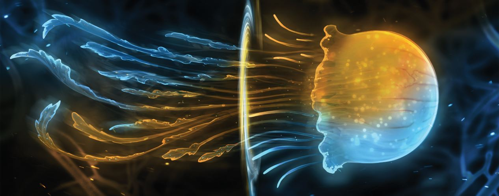

## Factsheet

**Developer:**  
Vivid Helix

**Release Date:**  
PlayStation 4/PC: 14 Feb 2017

Nintendo Switch (TM): 14 Sep 2017

PlayStation Vita: 10 Oct 2017

XBox One: Q4 2017

**Website:**  
[vividhelix.com/semispheres](vividhelix.com/semispheres)

**Devlog:**
[TIGSource](http://forums.tigsource.com/index.php?topic=48508.0)

## Description

 
<strong>Semispheres</strong> is a meditative parallel puzzle game that places dual realities at the heart of its challenge. Its unique single-player split-screen mechanic challenges your brain by putting you in control of two characters at the same time. Your left and right side must work together to unfold the mystery by solving clever puzzles in an entrancing ambience. Using portals and other abilities to avoid sentries, devise and execute your plan, reuniting the parallel worlds of Semispheres.
        

<strong>Key Features:</strong>
        <ul>
        <li>More than 50 levels, each building on top of each other, culminating with fiendishly complex puzzles</li>
        <li>Stealth-inspired gameplay, including abilities like noise-makers, portals, side-swapping, teleporting and more</li>
        <li>Immersive ambient soundtrack by Sid Barnhoorn, composer for Antichamber, The Stanley Parable and Out There</li>
        <li>Mesmerizing and soothing bichromatic art style comprised of warm blues and oranges</li>
        <li>A heartwarming story about a boy and his robot, unfolding in parallel with the puzzle progression</li>
            </ul>
        

## History

Semispheres started off as a Ludum Dare entry for LD30 - Connected Worlds. It went through four different names (Symbiosis, Fusion Orange, Replicas then Semispheres). Art style also changed radically over the course of the project.

## Videos

Here's the game trailer:
<iframe src="//www.youtube.com/embed/rNDeVWej-GM" frameborder="0" allowfullscreen></iframe>

 
And a gameplay video:

<iframe src="//www.youtube.com/embed/Mw5iTXCywR4" frameborder="0" allowfullscreen></iframe>

## Screenshots

download these screenshots and more as ** [.zip (27MB)](../img/ss/press/screens/switch_screenshots.zip "Screenshots zip") **

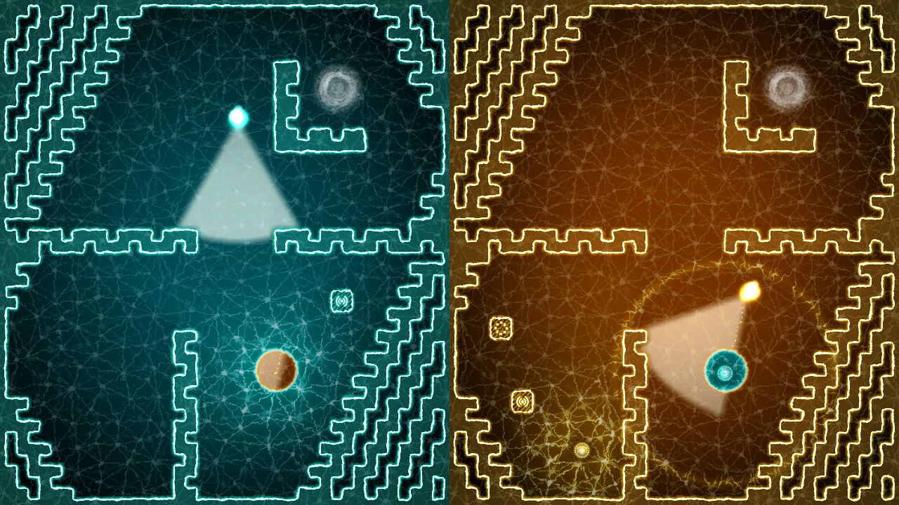
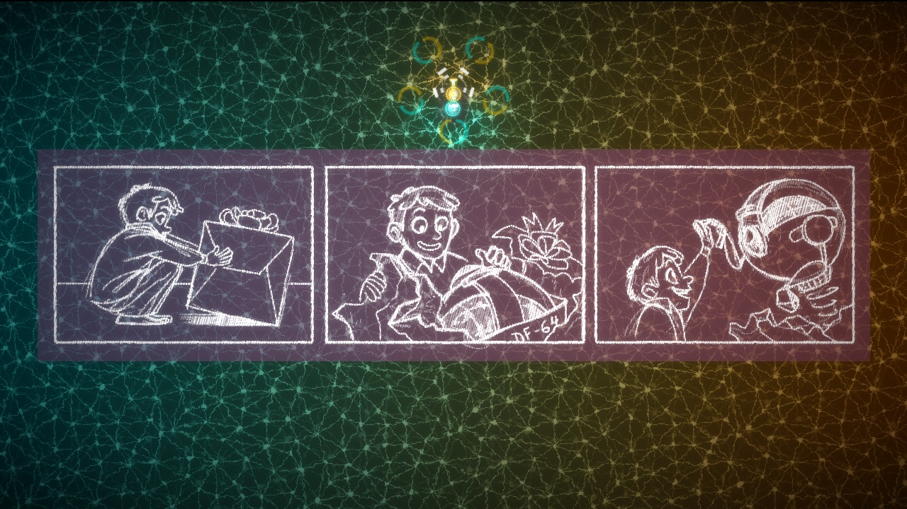
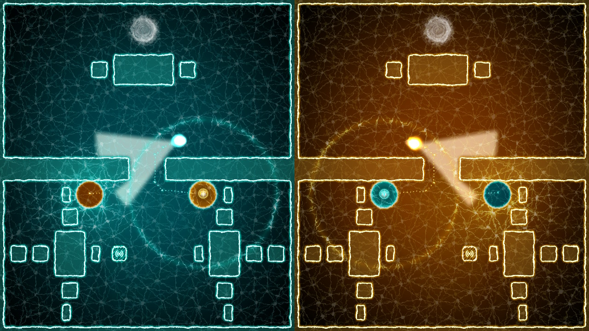
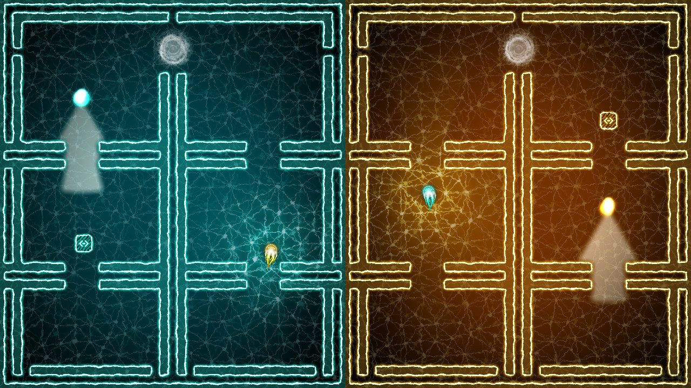
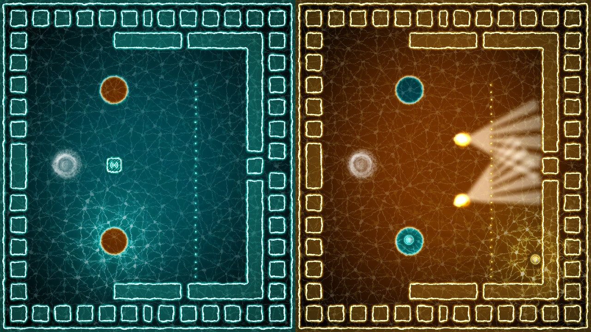
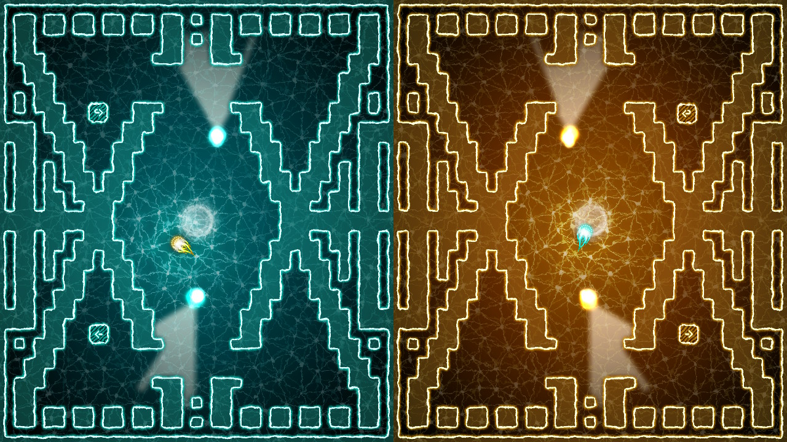

## Logos & Icon

download all logos/icon as ** [.zip (5MB)](../img/ss/press/logos/logos_and_icon.zip "Logos and icon") **

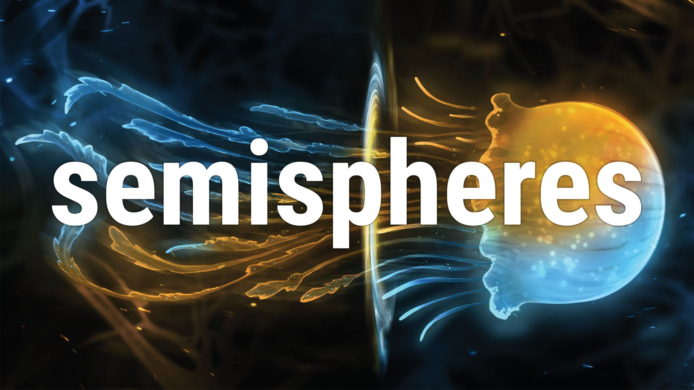
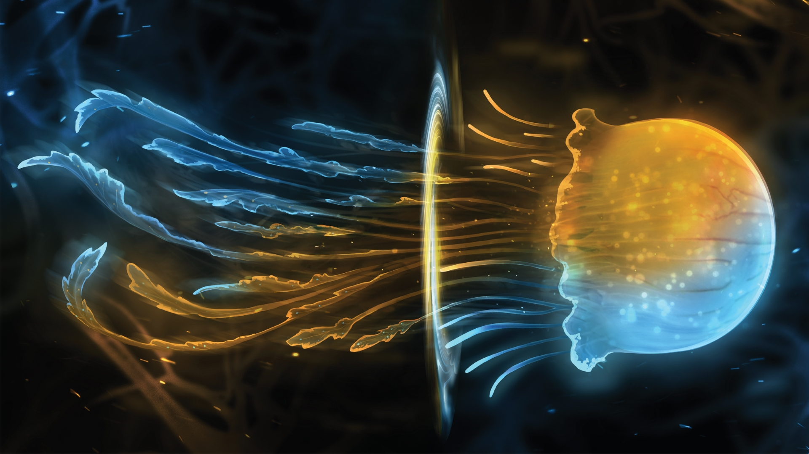
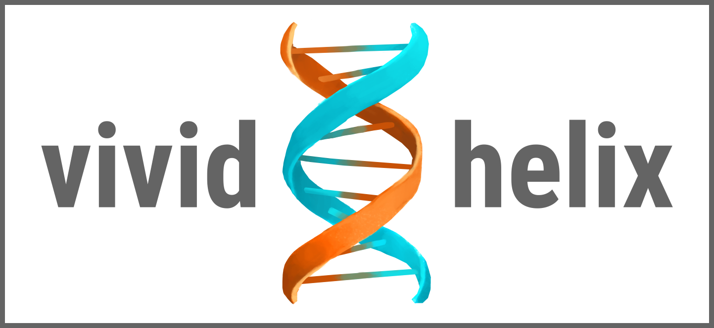
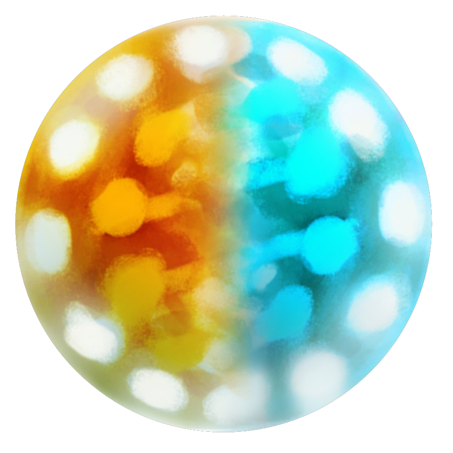

## Awards & Recognition

> * Winner of [**Digital Alberta 2015 Awards**](http://www.digitalalberta.com/awards) Gaming Category - *Oct 3rd, 2015*
> * Official [**#madewithunity showcase**](http://blogs.unity3d.com/2015/09/17/unite-boston-made-with-unity-showcase-line-up/) at [**Unite Boston 2015**](https://unity3d.com/unite/boston) - *Sep 22nd, 2015*
> * Official [**Indie Megabooth**](http://indiemegabooth.com/announcing-our-line-up-for-gdc-2016/) selection at [**GDC 2016**](http://www.gdconf.com/) - *Feb 9th, 2016*
> * Official [**Indie Megabooth**](http://indiemegabooth.com/event/pax-west-2016/) selection at [**PAX West 2016**](http://west.paxsite.com/) - *Sep 2nd-5th, 2016*
> * Finalist of [**SIGC**](http://powerofplay.us/sigc/) selection at [**Power of Play 2016**](http://powerofplay.us/) - *May 21st, 2016*
> * 2nd place at [**Intel Buzz Workshop Seattle**](https://software.intel.com/en-us/blogs/2016/06/28/intel-buzz-workshop-comes-back-to-seattle-for-a-4th-year-in-a-row) - *Jun 22nd, 2016*
> * Official [**Indie Prize**](http://indieprize.org/usa2016/index.html) selection at [**Casual Connect 2016 USA**](http://usa.casualconnect.org/) - *Jul 18th-20th, 2016*
> * Official [**Seattle Indies Expo**](http://seattleindies.org/six/) selection at [**SIX at PAX 2016**](http://seattleindies.org/six/) - *Sep 4th, 2016*
> * Official [**Indie Game Area**](http://expo.nikkeibp.co.jp/tgs/2016/public/en/map/list/index.html?category=338) selection at [**Tokyo Game Show 2016**](http://expo.nikkeibp.co.jp/tgs/2016/) - *Sep 15th-18th, 2016*
> * Official [**PAX Rising**](http://south.paxsite.com/) selection at [**PAX South 2017**](http://south.paxsite.com/) - *Jan 27th-29th, 2017*

## Articles

> * **http://www.brashgames.co.uk/2017/02/13/semispheres-review/98**
> * **http://gamingrespawn.com/reviews/19396/semispheres-review/**
> * **http://www.playstationlifestyle.net/2017/02/13/semispheres-review-preview-ps4-not-ass/#/slide/1**
> * **http://www.gamingcypher.com/semispheres-review-pc/**
> * **http://www.readersgambit.com/semispheres-ps4-review/**
> * **http://www.thegauntlet.ca/semispheres-to-be-first-calgary-made-game-launched-on-major-consoles/**
> * **http://www.stuff.tv/game-reviews/semispheres/review**
> * **https://www.youtube.com/watch?v=d17wccEbNY8**
> * **http://console-tribe.com/recensioni/semispheres-87924/**
> * **http://www.modacellulare.com/2017/02/13/recensione-semispheres-e-tutta-questione-di-coordinazione/**
> * **http://www.psbloggen.se/recensioner/recension-semispheres-ps4/**
> * **http://giocatoreanziano.blogspot.ca/2017/02/semispheres-ps4-recensione.html**
> * **http://www.tecnoandroid.it/2017/02/13/recensione-semispheres-tutta-questione-coordinazione-2171**
> * **http://www.presspauseradio.com/presspauseradio/2016/3/16/gdc-16-the-best-of-the-indie-mega-booth.html**
> * **http://www.gameinformer.com/b/features/archive/2016/03/20/the-very-best-indie-games-of-gdc-2016.aspx**
> * **http://spong.com/feature/10111450/Preview-Semispheres**
> * **http://maroonersrock.com/2017/01/semispheres-pax-south-hands/**
> * **http://www.vgblogger.com/pax-south-2017-final-impressions/39806/**
> * **http://mulehorngaming.com/2017/01/31/hands-on-impression-of-semispheres/**
> * **https://stack-up.org/semispheres-delights-with-wonderful-puzzle-gaming-pax-south-2017/**
> * **http://www.idigitaltimes.com/semispheres-puzzle-game-those-whod-rather-avoid-frustration-582599**
> * **https://trubros.com/2017/02/07/pax-south-2017-indie-games-pt-2/**
> * **http://www.platformnation.com/2017/02/02/semispheres-hands-on-at-pax-south-2017/**
> * **http://blog.us.playstation.com/2017/01/27/navigating-the-dual-world-of-semispheres-out-february-14-on-ps4/**
> * **https://blog.eu.playstation.com/2017/01/27/stylish-stealth-puzzler-semispheres-launches-on-ps4-next-month/**
> * **http://www.aybonline.com/2016/02/24/semispheres-where-two-ends-meet**
> * **https://www.pastemagazine.com/articles/2016/09/the-best-games-from-tokyo-game-show-2016.html**
> * **http://www.thegauntlet.ca/calgary-developer-prepares-trip-to-san-francisco-to-show-off-indie-puzzle-game**
> * **http://www.onlysp.com/indie-roundup-2-1-16**
> * **http://gmofficial.com/double-down-on-your-puzzle-solving-skills**
> * **http://indiegames.com/2016/02/trailer_roundup_february_17.html**
> * **http://www.metronews.ca/news/calgary/2016/02/28/calgary-game-selected-for-global-conference.html**
> * **http://www.metronews.ca/news/calgary/2016/01/21/calgarys-most-promising-locally-developed-video-games.html**
> * **http://gigazine.net/news/20160917-semisphere-tgs2016**
> * **http://www.modacellulare.com/2017/02/06/semispheres-vediamo-il-trailer-di-lancio-del-gioco-in-arrivo-su-ps4**
> * **http://www.startvideojuegos.com/semispheres-puzles-paralelos**
> * **http://www.versusmedia.mx/duplica-capacidad-resolver-acertijos-semispheres**
> * **http://www.graal.fr/2016/02/21/semispheres**
> * **http://linfotoutcourt.com/semispheres-coordination-motrice**

## Project Credits

**Development/Design/Art**
Radu Muresan

**Audio**
[Sid Barnhoorn][audio]

**Additional work - Narrative design**
[Alex De-Gruchy][narrative]

**Additional work - Illustration/Story Art**
[Lyndsay Wasko][illustration]

## Contact

**Inquiries**  
[radu@vividhelix.com][contact]

**Twitter**  
[twitter.com/VividHelix][twitter]

**Web**  
[vividhelix.com][homepage]

<!--- =====================================================================  -->
<!--- Referenced links -->

[homepage]: https://vividhelix.com "Vivid Helix"

[contact]: mailto:radu@vividhelix.com

[audio]: http://www.sidbarnhoorn.com/

[narrative]: http://alexde-gruchy.blogspot.co.uk/2016/02/writing-and-editing-credits.html

[illustration]: http://www.lyndsaywasko.com/

<!--- Social -->

[twitter]: https://twitter.com/VividHelix

## Monetization Permission

Vivid Helix allows for the contents of Semispheres to be published through video broadcasting services for any commercial or non-commercial purposes.
Monetization of videos created containing assets from Semispheres is legally & explicitly allowed by Vivid Helix. This permission can be found in writing at [**http://semispheresgame.com/press/index.html#semispheres-monetization-permission**](https://semispheresgame/press/index.html#semispheres-monetization-permission)
